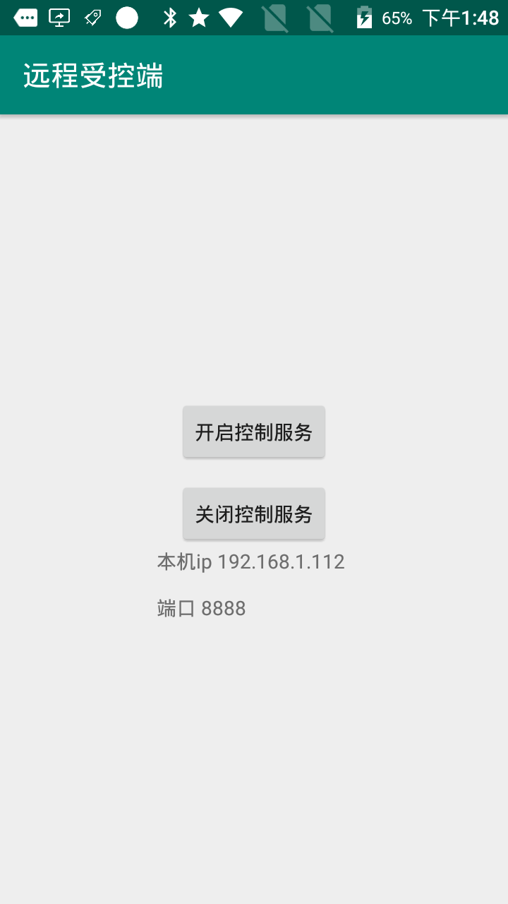
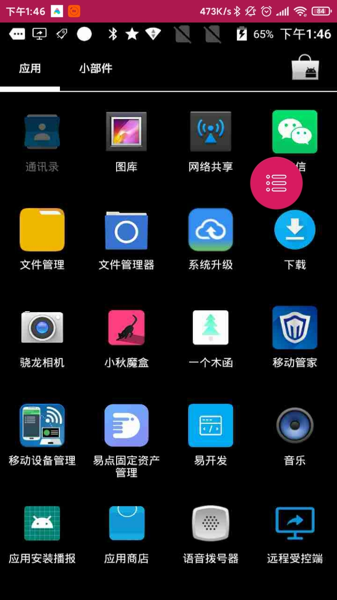
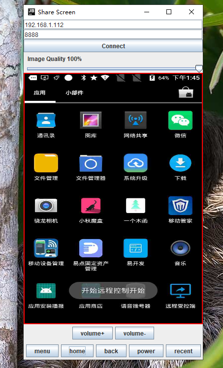

## 局域网远程控制

#### module
1. `app`: 受控端 - android ，`需要系统签名！`
2. `client_gui_android`: 控制端 - android
3. `client_gui_java`: 控制端 - java

#### 截图
|  |  |  |
| :--: | :--: | :--: |
| 受控端 | 控制端-android | 控制端-java |